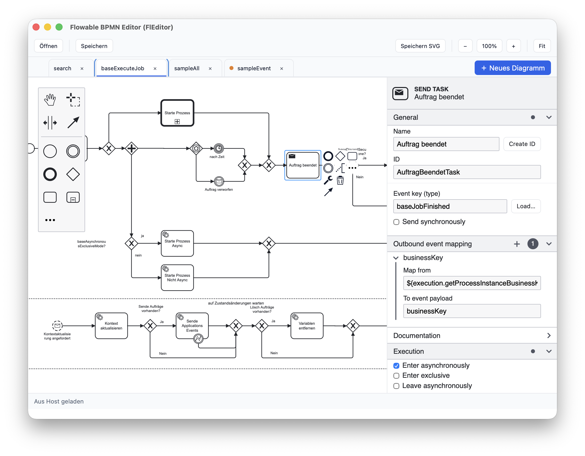
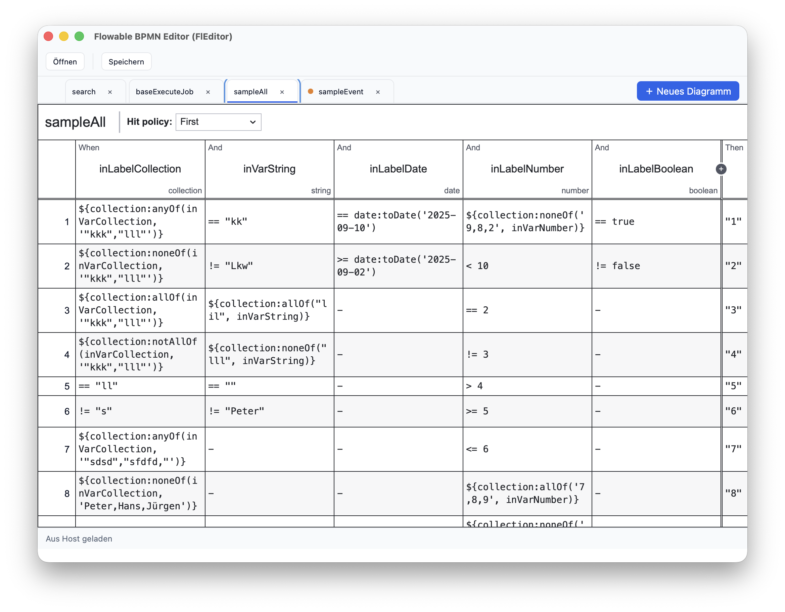
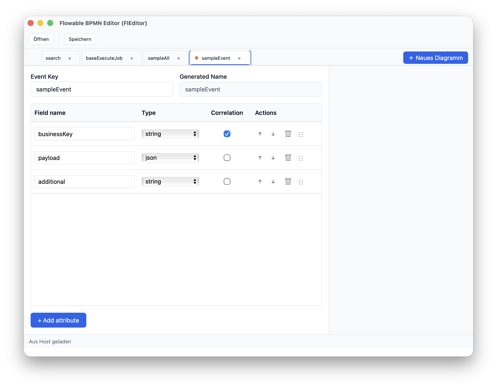

# FLEditor BPMN

Ein vielseitiger Multi-Format Editor zum Erstellen und Bearbeiten von BPMN-Diagrammen, DMN-Entscheidungstabellen und Event-Definitionen. Basiert auf den bewährten [bpmn-js](https://github.com/bpmn-io/bpmn-js) und [dmn-js](https://github.com/bpmn-io/dmn-js) Bibliotheken mit Fokus auf Flowable-spezifische Eigenschaften und eine intuitive Benutzeroberfläche.

## Über dieses Projekt

Dies ist mein erstes "Vibe-Coding" Projekt mit GPT-Codex und Claude Code. Es hat mir unglaublich viel Spaß gemacht, auch wenn ich keine Ahnung von TypeScript-Programmierung habe und daher nicht beurteilen kann, wie gut oder schlecht der generierte Code ist. Mit dem fertigen Editor bin ich jedoch sehr zufrieden - er erfüllt alle meine Anforderungen und bietet eine moderne, effiziente Arbeitsumgebung für BPMN-Modellierung.

## Voraussetzungen

- [Node.js](https://nodejs.org/) und npm

## Installation

```bash
npm install
```

## Entwicklung

Startet einen lokalen Entwicklungsserver unter http://localhost:5173/:

```bash
npm run dev
```

## Build

Erzeugt eine produktive Build-Version im Ordner `dist/`:

```bash
npm run build
```

Vorschau der gebauten Anwendung:

```bash
npm run preview
```

## Tauri (Desktop)

Voraussetzungen (Windows):
- Node.js 18+
- Rust (stable, x86_64-pc-windows-msvc) → https://rustup.rs
- Visual Studio 2022 Build Tools (C++ Desktop Workload)
- Tauri CLI (wird per devDependency mitinstalliert)

Entwicklung (Desktop, verwendet Webview und Plugins):

```bash
npm run dev:tauri
```

Build (Bundle):

```bash
# macOS .app (Standard)
npm run build:tauri

# Windows Installer (NSIS)
npm run build:win:nsis

# Windows Installer (MSI, WiX Toolset erforderlich)
npm run build:win:msi

# Beides (NSIS + MSI)
npm run build:win:all
```

Ausgabe:
- macOS: `src-tauri/target/release/bundle/macos/Flowable BPMN Editor.app`
- Windows (NSIS): `src-tauri/target/release/bundle/nsis/Flowable BPMN Editor_*_x64-setup.exe`
- Windows (MSI):  `src-tauri/target/release/bundle/msi/Flowable BPMN Editor_*_x64_en-US.msi`

Datei‑Verknüpfungen:
- Windows: bevorzugt `.bpmn`; doppelte Suffixe wie `.bpmn20.xml` gelten als `.xml`.
- macOS/Windows: „Öffnen mit …“ ist unterstützt. Bei Kaltstart‑Problemen auf macOS bitte App zuerst starten und dann Datei per „Öffnen mit …“ öffnen.

Hinweise für Windows‑Builds:
- NSIS: Installiere NSIS 3.x und stelle sicher, dass `makensis` im `PATH` liegt.
- MSI: Installiere WiX Toolset v3 (candle.exe, light.exe im `PATH`).

## Features

- **Multi-Format Support**: BPMN 2.0 Diagramme, DMN Decision Tables, Event Registry Definitionen
- **Multi-Tab Interface**: Arbeiten mit mehreren Diagrammen gleichzeitig
- **Flowable Integration**: Spezielle Properties und Erweiterungen für Flowable Engine
- **Properties Panel**: Umfangreiche Konfigurationsmöglichkeiten für alle BPMN-Elemente
- **Import/Export**: Unterstützung für verschiedene Dateiformate
- **Desktop App**: Native Desktop-Anwendung mit Tauri
- **Inline Editing**: Moderne UI mit intelligenten Eingabefeldern und Buttons
- **Auto-ID Generation**: Automatische Generierung von eindeutigen IDs aus Element-Namen

## Screenshots

Einige Eindrücke aus der Anwendung:



*Hauptansicht des Editors mit BPMN-Diagramm*



*Bearbeiten von Elementen im Properties Panel*



*Bearbeiten von Elementen im Properties Panel*


## Technologien

### Core Libraries
- **BPMN**: bpmn-js (v11.0.0) - BPMN 2.0 Modeler und Viewer
- **DMN**: dmn-js (v17.4.0) - Decision Model and Notation Editor
- **Properties**: @bpmn-io/properties-panel (v2.2.0), bpmn-js-properties-panel (v1.26.0)

### Build & Development
- **Build System**: Vite (v7.1.5) - Next Generation Frontend Tooling
- **Language**: TypeScript (v5.9.2) - Type-safe JavaScript
- **Desktop**: Tauri (v2.8.x) - Rust-based Desktop App Framework

### Architecture
- **State Management**: Custom Reducer Pattern mit zentralem Store
- **Module System**: ES Modules mit TypeScript
- **Component Architecture**: Modular, erweiterbare Struktur
- **Sidecar Integration**: Lightweight Protocol für Host-Embedding

## Projektstruktur

```
fleditor-bpmn/
├── index.html                           # Einstiegspunkt der Anwendung
├── src/
│   ├── main.ts                         # App Bootstrap und Initialisierung
│   ├── tab-manager.ts                  # Multi-Tab State Management
│   ├── modeler-setup.ts                # BPMN/DMN Modeler Konfiguration
│   ├── file-operations.ts              # File I/O und XML Processing
│   ├── ui-controls.ts                  # Toolbar und UI Controls
│   ├── change-tracker.ts               # Dirty State Management
│   ├── bpmn-tabs/                      # Accessible Tabs Manager
│   ├── dmn-support.ts                  # DMN Decision Table Integration
│   ├── event-editor/                   # Event Registry Editor
│   ├── properties/                     # Properties Panel System
│   │   ├── flowable-properties-provider.ts
│   │   ├── contributors/               # Element-spezifische Contributors
│   │   └── entries/                    # UI Entry Components
│   ├── sidecar/                        # Host Integration Protocol
│   │   ├── shared/protocol.ts          # Protocol v1.0.0
│   │   ├── transports/                 # Transport Layer
│   │   └── bridge.ts                   # Request/Response Bridge
│   ├── state/                          # Redux-style State Management
│   └── integrations/                   # Editor Registry
├── src-tauri/                          # Tauri Desktop App
├── styles.css                          # Globale Styles
├── package.json                        # Dependencies und Scripts
└── tsconfig.json                       # TypeScript Konfiguration
```

### Wichtige Module

- **Multi-Tab System**: Ermöglicht gleichzeitiges Arbeiten mit mehreren Diagrammen
- **Properties Panel**: Modular aufgebautes System für Element-Konfiguration
- **Sidecar Integration**: Embedding in externe Host-Anwendungen
- **State Management**: Zentralisiertes State Management mit Reducer Pattern

## Entwicklung & Beitrag

Dieses Projekt wurde komplett mit KI-Assistenten (GPT-Codex und Claude Code) entwickelt. Der gesamte TypeScript-Code wurde generiert, da ich als Entwickler keine Erfahrung mit TypeScript habe. Das Projekt zeigt eindrucksvoll, was mit modernen KI-Tools im Bereich der Softwareentwicklung möglich ist.

## Lizenz

Dieses Projekt steht unter der MIT-Lizenz. Weitere Details finden Sie in der [LICENSE](LICENSE) Datei.

## Drittanbieter-Lizenzen

Informationen zu den verwendeten Drittanbieter-Bibliotheken und deren Lizenzen finden Sie in der [THIRD_PARTY.md](THIRD_PARTY.md) Datei.
